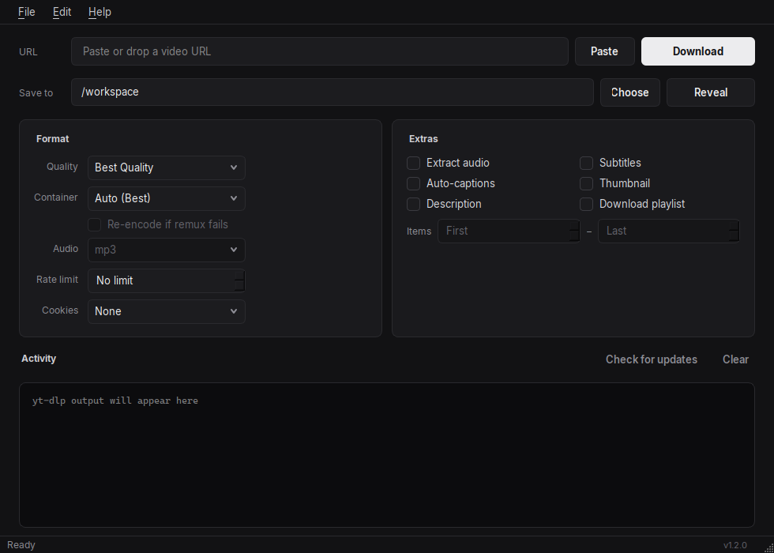

# dlp

**Desktop GUI for [yt-dlp](https://github.com/yt-dlp/yt-dlp).** Download video and audio from YouTube, Twitch, Twitter, and 1,000+ other sites — no command line.

[](https://github.com/datadamorte/dlp/actions/workflows/ci.yml)
[](LICENSE)
[](https://www.python.org/downloads/)
[](#install)



Paste a URL, pick a quality, click **Download**. The app keeps yt-dlp up to date, remembers your folder, and can use browser cookies when a site returns 403.

If this saves you time, a star helps other people find it.

## Install

### Portable build (Windows, macOS, Linux)

Grab the latest zip/tarball from **[Releases](https://github.com/datadamorte/dlp/releases)**, unpack it, and run `yt-dlp-gui` (or `yt-dlp-gui.exe` on Windows).

The first launch downloads a `yt-dlp` binary if needed. [ffmpeg](https://ffmpeg.org/) is recommended so video and audio can be merged.

> GitHub Releases are produced by tagging `v*` (for example `v1.2.0`). Until a tag exists, use **Run from source** below, or run the **Release** workflow from the Actions tab.

### Run from source

**Python 3.10+** is required.

```bash
git clone https://github.com/datadamorte/dlp.git
cd dlp
```

**macOS / Linux:**

```bash
chmod +x setup.sh
./setup.sh
source venv/bin/activate
python yt_dlp_gui.py
```

**Windows:**

```cmd
setup.bat
venv\Scripts\activate
python yt_dlp_gui.py
```

Or manually: `python3 -m venv venv`, activate it, then `pip install -r requirements.txt`.

## Features

| Area | What you get |
|------|----------------|
| **Downloads** | Quality presets (best, 1080p, 720p, 480p, 360p, audio-only), container remux (MP4 / MKV / WEBM), optional re-encode |
| **Audio** | Extract audio only as mp3, m4a, wav, or flac |
| **Extras** | Subtitles, auto-generated captions, thumbnails, video descriptions |
| **Playlists** | Optional full-playlist download, start/end range, one folder per playlist |
| **Control** | Custom save folder, speed limit (KB/s), cancel in progress (Esc) |
| **Auth** | Optional browser cookies (Chrome, Firefox, Safari, Edge, Brave, Opera) for 403 / restricted videos |
| **UX** | Live progress (percent, speed, ETA), activity log, clipboard URL detection, drag-and-drop URLs, Reveal folder |
| **Updates** | Auto-updates yt-dlp on launch; **Check for updates** in the header or Help menu anytime |

## Usage

1. Start the app (portable exe or `python yt_dlp_gui.py`).
2. Paste a URL, drop one onto the window, or copy one — clipboard detection fills the field if it is empty.
3. Pick quality, container, and any extras.
4. Choose the save location if needed.
5. Click **Download**. Use **Cancel** or **Esc** to stop a run in progress.

Video files are saved as `Title [id].ext` so same-named videos do not overwrite each other. Playlists go into a subfolder named after the playlist. Settings such as the last output directory are remembered between sessions.

### Options

| Control | Description |
|---------|-------------|
| **Quality** | Cap resolution or pick audio-only (`Best Quality`, `1080p`, `720p`, `480p`, `360p`, `Audio Only`) |
| **Container** | Remux output when downloading video: `Auto (Best)`, `MP4`, `MKV`, `WEBM` (no re-encode unless you opt in) |
| **Re-encode container** | Force ffmpeg re-encode into the chosen container. Slower; only needed if remux fails |
| **Audio** | Used with **Extract audio** or **Audio Only**: `mp3`, `m4a`, `wav`, `flac` |
| **Rate limit** | Max download speed in KB/s (`No limit` when set to 0) |
| **Cookies** | Browser whose cookies yt-dlp should use (helps with 403 / login walls) |
| **Extract audio** | Download only the audio track |
| **Subtitles** | Save available subtitles |
| **Auto-captions** | Include auto-generated captions (works even if official subs are off) |
| **Thumbnail** | Save the video thumbnail |
| **Description** | Save the description as a text file |
| **Download playlist** | If the URL is a playlist, download all entries instead of a single video |
| **Items** | 1-based playlist index range when a playlist is enabled (`First` / `Last` = unbounded) |

### Keyboard shortcuts

| Shortcut | Action |
|----------|--------|
| **Ctrl+V** | Paste into the focused field (URL field accepts a copied link) |
| **Ctrl+Shift+V** | Paste a URL from the clipboard into the URL field |
| **Enter** | Start download (when the URL field is focused) |
| **Ctrl+Enter** | Start download from anywhere in the window |
| **Esc** | Cancel the download in progress |
| **Ctrl+L** | Clear the activity log |
| **Ctrl+O** | Reveal the save folder |
| **Ctrl+Shift+O** | Choose a save folder |

## Tests

```bash
python -m unittest discover -s . -p 'test_*.py'
```

## Project layout

```
dlp/
├── yt_dlp_gui.py      # Desktop GUI
├── ytdlp_core.py      # Command building, path lookup, progress parsing
├── test_ytdlp_core.py # Unit tests (no network)
├── packaging/build.py # PyInstaller portable build
├── docs/screenshot.png
├── requirements.txt
├── setup.sh / setup.bat
├── LICENSE            # MIT
└── README.md
```

yt-dlp itself is **not** stored in this repo. The app downloads it next to the executable on first run, or uses a copy on your `PATH`.

## Troubleshooting

### HTTP 403 Forbidden

YouTube (and some other sites) may block anonymous or bot-like clients.

1. Set **Cookies** to a browser where you are logged in (e.g. Safari, Chrome, Firefox).
2. Keep that browser closed or unlocked as needed for cookie access on your OS.
3. Retry the download — yt-dlp will use that browser’s cookies.

### “ffmpeg is not installed” / formats won’t merge

The app warns on startup if ffmpeg is missing. Install it and ensure it is on your `PATH`:

**macOS:** `brew install ffmpeg`

**Linux (Debian/Ubuntu):** `sudo apt install ffmpeg`

**Linux (Fedora):** `sudo dnf install ffmpeg`

**Windows:** Download from [ffmpeg.org](https://ffmpeg.org/download.html) and add the `bin` folder to your system `PATH`.

If a chosen container fails to remux, enable **Re-encode if remux fails** (slower, re-encodes video).

### Startup update failed

If the log says the startup update was skipped, downloads still work. Fix network access or click **Check for updates** later. You can also install or upgrade manually:

```bash
pip install -U yt-dlp
```

### Windows SmartScreen / antivirus

Portable PyInstaller builds are often unsigned, so Windows may warn on first run. That is expected until the build is code-signed. You can also run from source with Python if you prefer.

### Python version

Use **Python 3.10 or newer**. Older versions may fail with current yt-dlp releases.

### yt-dlp missing entirely

Let the app download it on first run, install via pip, or place a binary named `yt-dlp` (or `yt-dlp.exe` on Windows) next to the app.

## Building a portable bundle locally

```bash
pip install -r requirements.txt pyinstaller
python packaging/build.py --bundle
```

Output is `dist/yt-dlp-gui/` (or `yt-dlp-gui.app` on macOS) plus a zip/tarball next to the repo root. GitHub Actions does the same on each `v*` tag.

## License

MIT. See [LICENSE](LICENSE).

This project is a thin GUI around [yt-dlp](https://github.com/yt-dlp/yt-dlp). Respect the terms of service of sites you download from, and local copyright law.
